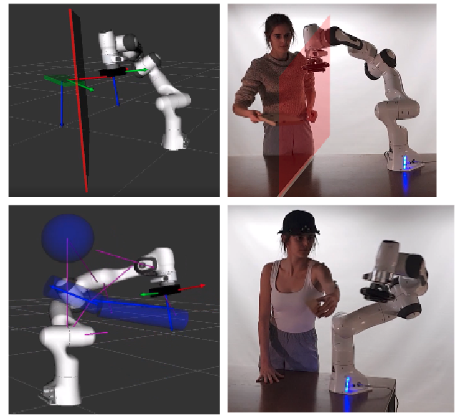
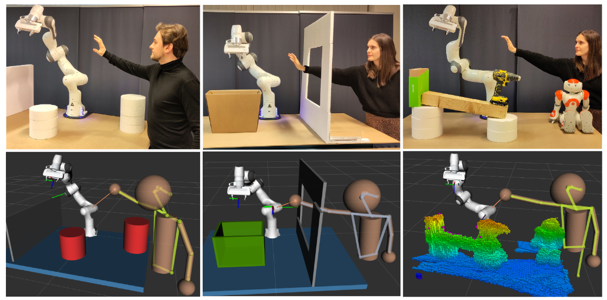

.. role:: raw-html(raw)
    :format: html

Safe Human-Robot Collaboration
==============================

We want to provide a ROS-based open source code framework that enables users to test our proposed planning and control framework for exemplary numerical and experimental validation cases on the 7DOF Franka Emika Panda robot, and in realistic Human-Robot Collaboration (HRC) scenarios with Vicon motion capture data and Stereolabs ZED2 data.

.. note:: The explanation on this website is still under construction. 
            The GitHub repository, https://github.com/panda-brubotics, we are referring to is still private, but will be made public when all relevant articles are published.  
            People from VUB and CU Boulder that are invited to the private repo may not share the content with others.
            For questions, you can always contact Kelly Merckaert: kelly.merckaert@vub.be.

.. |youtube_safeHRC_ERG_vicon| raw:: html

    <a href="https://youtu.be/UzbhMzcKSbE?si=UJyQCnraBKLG9WBJ" target="_blank">   (video) </a>

.. |article_safeHRC_ERG_vicon| raw:: html

    <a href="https://www.sciencedirect.com/science/article/pii/S0736584521001022?via%3Dihub" target="_blank">   (article) </a>

   We show how a robotic manipulator can reactively avoid collisions with a human by employing the trajectory-based Explicit Reference Governor (ERG) and the Vicon motion capture system. |article_safeHRC_ERG_vicon| |youtube_safeHRC_ERG_vicon| 

.. |youtube_safeHRC_ERG_ZED| raw:: html

    <a href="https://youtu.be/Bexqb_9MLGI?si=Fd_Tj4uIaSakBDPw" target="_blank">   (video) </a>

.. |article_safeHRC_ERG_ZED| raw:: html

    <a href="https://www.sciencedirect.com/science/article/pii/S0736584523001862" target="_blank">   (article) </a>

   We show how a robotic manipulator can reactively reach its end-effector pose references and avoid collisions with the static cluttered environment and humans by employing a Rapidly-exploring Random Tree (RRT) and trajectory-based ERG algorithm, using the Stereolabs ZED2 camera to detect the obstacles. |article_safeHRC_ERG_ZED| |youtube_safeHRC_ERG_ZED| 

-----------------
Table of contents
-----------------

.. toctree::
   :maxdepth: 1

   introduction/introduction
   panda_system/panda_system
   simulation/simulation
   hardware/hardware
   archive/archive

-----------------
References
-----------------

[1] K. Merckaert, B. Convens, C. Wu, A. Roncone, M. M. Nicotra, and B. Vanderborght, **Real-time motion control of robotic manipulators for safe human-robot coexistence**, *Robotics and Computer-Integrated Manufacturing*, vol. 73, pp. 102223, Feb. 2022, |10.1016/j.rcim.2021.102223|.

[2] K. Merckaert, B. Convens, M. M. Nicotra, and B. Vanderborght, **Real-Time Constraint-Based Planning and Control of Robotic Manipulators for Safe Human-Robot Collaboration**, *Robotics and Computer-Integrated Manufacturing*, vol. 87, pp. 102711, June 2024, |10.1016/j.rcim.2023.102711|.

.. |10.1016/j.rcim.2021.102223| raw:: html

    <a href="https://doi.org/10.1016/j.rcim.2021.102223" target="_blank">10.1016/j.rcim.2021.102223</a>

.. |10.1016/j.rcim.2023.102711| raw:: html

    <a href="https://doi.org/10.1016/j.rcim.2023.102711" target="_blank">10.1016/j.rcim.2023.102711</a>

-----------------
Acknowledgement
-----------------
This work is supported by the EU H2020 project SOPHIA (grant number 871237), the Flemish Government under the program *Onderzoeksprogramma Artificiële Intelligentie (AI) Vlaanderen*, and the EU Horizon Europe Framework Programme euROBIN (grant number 101070596). 

|pic1| any text |pic2|

